# How the applications in this repository were defined in Merlin

Everything under [`applications/`](applications) came out of a few pages of
[Merlin Studio](https://app.merlin-studio.cloud). This is what those pages ask,
in order, using the four applications in this repository as the running example.
It takes about ten minutes once a cloud foundation exists, and guest mode needs
no signup.

The idea behind the pages is one sentence: **you say what an application is for,
and what it implies is derived.** You pick an architecture — "an API with its own
database that publishes events" — and the identities, the grants, the network
paths, the encryption keys and the projects follow from the arrows in it and from
the foundation it lands on. Nobody is asked for a service account.

- [How the applications in this repository were defined in Merlin](#how-the-applications-in-this-repository-were-defined-in-merlin)
  - [Before you start](#before-you-start)
  - [1. The front door](#1-the-front-door)
  - [2. Departments (optional)](#2-departments-optional)
    - [If you define no departments](#if-you-define-no-departments)
  - [3. A plan](#3-a-plan)
  - [4. Applications](#4-applications)
    - [Choose an architecture](#choose-an-architecture)
    - [Name it, place it, add it](#name-it-place-it-add-it)
    - [The application's card](#the-applications-card)
  - [5. The platform pages](#5-the-platform-pages)
  - [6. Review and generate](#6-review-and-generate)
  - [What you get](#what-you-get)
  - [Supported architectures](#supported-architectures)
    - [Serverless](#serverless)
    - [AI](#ai)
    - [Data and devices](#data-and-devices)
    - [Hybrid](#hybrid)
    - [Kubernetes](#kubernetes)
    - [Virtual machines](#virtual-machines)

## Before you start

Applications are built **on** a cloud foundation, so one has to exist first:
finish the foundation wizard and press **Generate landing zone**. The
application pages read what that foundation actually contains — its
environments, networks, clusters, keys and hybrid links — and that is what makes
the rest possible. It also decides what you will be offered: an architecture that
reaches a datacentre needs a foundation with a VPN or an Interconnect, and one
that runs on Kubernetes needs a foundation with a GKE cluster.

If the foundation's configuration changes later, regenerate it before touching
the applications. They are compiled against the foundation as it stands, and
Merlin will say so rather than build on a stale one.

## 1. The front door

**Workloads** in the top bar, or **Configure workloads** on the foundation's
summary page. The page lays out the three layers, in the order they are built:

1. **Landing zone** — the foundation, already generated.
2. **Departments** — the teams your applications belong to.
3. **Application plans** — one set of applications on this foundation.

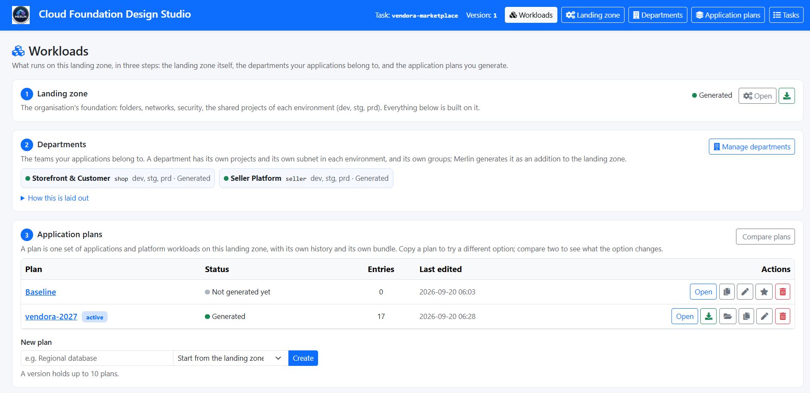

## 2. Departments (optional)

A department is a business unit with its own team, its own projects and its own
data: a developer of one department cannot reach another's data, even in dev.
Merlin generates it as an *addition* to the foundation — new projects, a subnet
per environment, a key ring, a budget, deploy identities — touching nothing the
foundation owns. Defining them is optional, and the rest of this section says
what follows from each answer.

Give it a **code** (2 to 8 lowercase letters and digits — it becomes part of
every project id), a **name**, and its **environments**, then **Create**. This
repository has two: `shop` and `seller`.

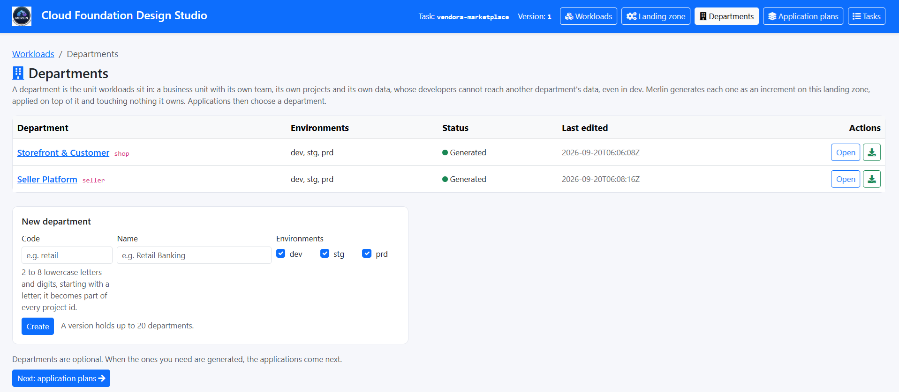

The department opens on its **confirm table**: the facts its Terraform is built
against. Every line arrives filled in from the foundation — the project prefix,
the region, the key project, and for each environment the network, the host
project and a free subnet range. Billing account is not an obligatory field. If you prefer not to provide it for confidentiality reasons, Merlin will generate a placeholder (a fake account). Merlin also uses placeholders for folder numbers, which do not exist until the foundation is applied. Both values appear as placeholders, and the real ones are placed together in a single file within the bundle. Add the team's groups and a budget, **Save**, then
**Generate**.

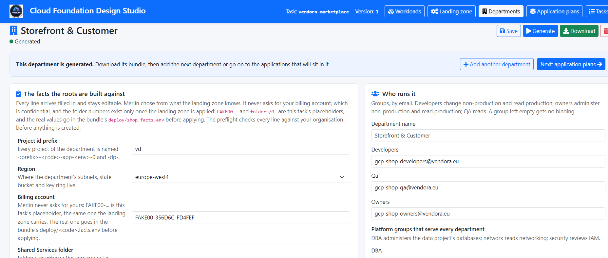

### If you define no departments

**Nothing stops working.** Every application then lands in the
environment's shared projects — `app-<env>-0` for its services, `dp-<env>-0`
for its data, on that environment's shared subnet — which is where the cluster,
the registry and the delivery pipelines live in any case. The Applications page
prints those project names before you add anything, and the department dropdown
reads *Shared projects (no department)*. It offers a link to create one; nothing
requires it, and the bundle that comes out is complete either way.

**What you give up is a boundary, not a feature.** With no department, every
application in an environment shares one project pair, so a team's service
accounts and its developers sit beside everyone else's data and isolation ends
at the grants you can name rather than at the project. One deploy identity
applies all of it — `iac-app-<env>` for every application stage, where a
department's stages are applied by its own `iac-<code>-<env>` — and there is one
key ring, one budget and one subnet to read a bill or an audit log against. For
one team, that is the simpler thing and the right answer.

**The choice is not permanent.** A department is an increment on the landing
zone rather than a property of it: create one later and generate it, and the
landing zone is not regenerated and what is already running is untouched. Point
an existing application at it, generate the plan again, and `CHANGES.md` lists
what moved. Do note that it is a real move — different projects, a different
subnet, so the resources are recreated rather than relabelled — which costs
nothing before the first apply and quite a lot after it.

## 3. A plan

A plan is one set of applications and platform workloads on this foundation,
with its own history and its own bundle. Name it and **Create**. A plan can start
from the foundation's own proposal or as a copy of another plan — copy one to try
a different option, and **Compare plans** shows exactly what the option changes.

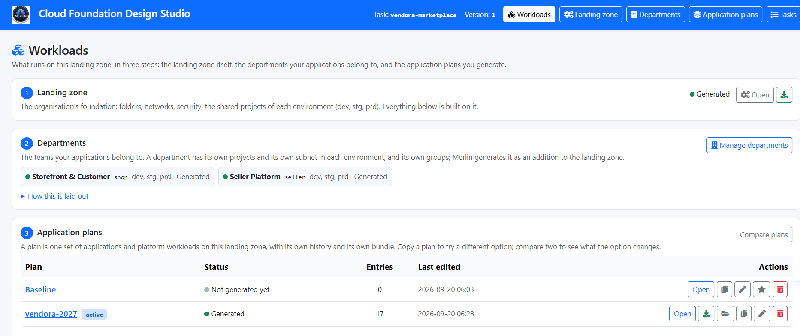

## 4. Applications

The Applications page works in three steps, printed at the top of it:

1. choose an architecture, or one of your blueprints;
2. name the application and choose its environments;
3. add it, repeat for each application, then continue.

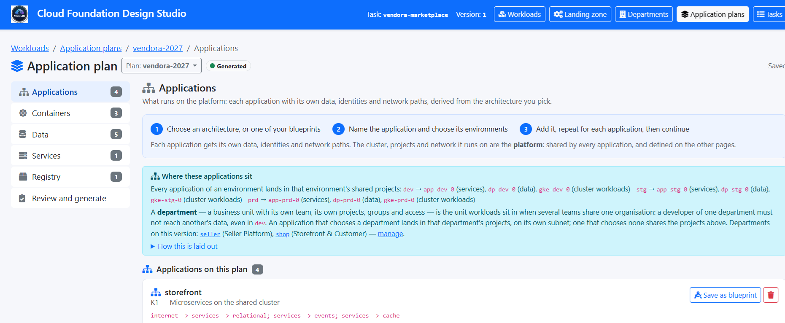

### Choose an architecture

Each card is one architecture: a name, its flow written as arrows, and two
sentences on what it is. Tabs narrow the list by family — Serverless, AI, Data
and devices, Hybrid, Kubernetes, Virtual machines. The whole card is the button.

### Name it, place it, add it

Under the chooser: a **name**, the **environments** it runs in, and its
**department**. Leave the department at *Shared projects* and the application
lands in each environment's shared projects; choose one and it lands in that
department's own projects, on its own subnet, while the cluster and the network
stay shared. Then **Add to this plan**.

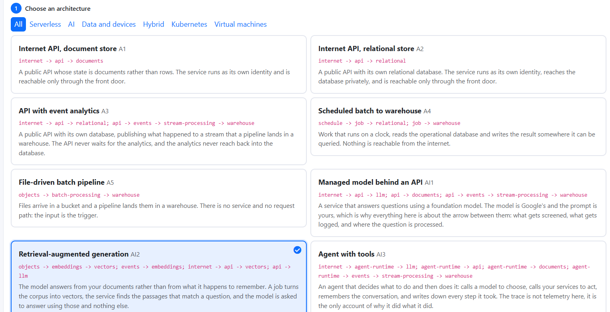

The four in this repository:

| Name | Architecture | Department |
|---|---|---|
| `storefront` | Microservices on the shared cluster | `shop` |
| `checkout` | API with event analytics | `shop` |
| `inventory-replica` | Database replication to the cloud | `seller` |
| `seller-assistant` | Retrieval-augmented generation | `seller` |

### The application's card

Once added, the application has a card of its own with three parts.

**What you decide.** The few questions only you can answer — the size of the
database, the source engine of a replication, a schedule, a container image.
Where Merlin has a default it says what it is, *in the option itself*: "Merlin
decides (production: medium, elsewhere: small)". What can be derived is not
asked: a replication asks what the source database is, and the replica's engine
follows from it. **Press Apply on the card when you change something** — each
card saves its own answers.

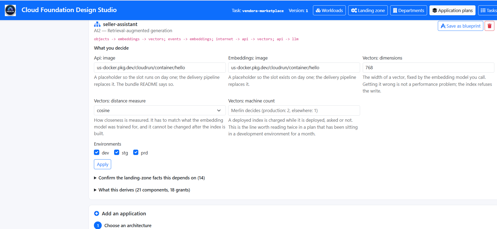

**Confirm the landing-zone facts this depends on.** The projects this
application will land in, per environment, read from the foundation and the
department. They are dropdowns, not text boxes: you choose among what exists.

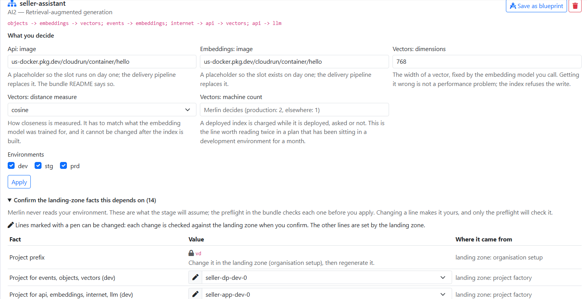

**What this derives.** Every component and every IAM grant the architecture
implies, counted in its heading and listed before anything is generated. This is the
list that becomes Terraform, and the reason for each grant is the arrow that
needs it.

A card you are happy with can be kept with **Save as blueprint**: the
architecture and its answers, reusable by name. The next application of the same
shape then needs a name and its environments and nothing else.

## 5. The platform pages

**Containers, Data, Services** and **Registry** hold what the applications run
on rather than the applications themselves: the namespaces on each GKE cluster,
the shared datasets and buckets, Cloud Run services and secrets, the container
registry. They arrive proposed from the foundation. Look through them, adjust
what you need, and **Save** — generation needs a plan that has been saved at
least once, because saving is what records the list the bundle is built from.

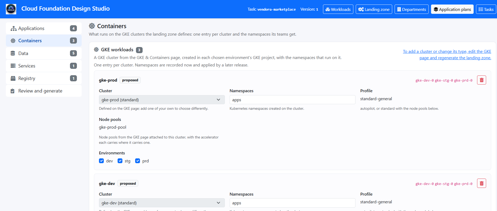

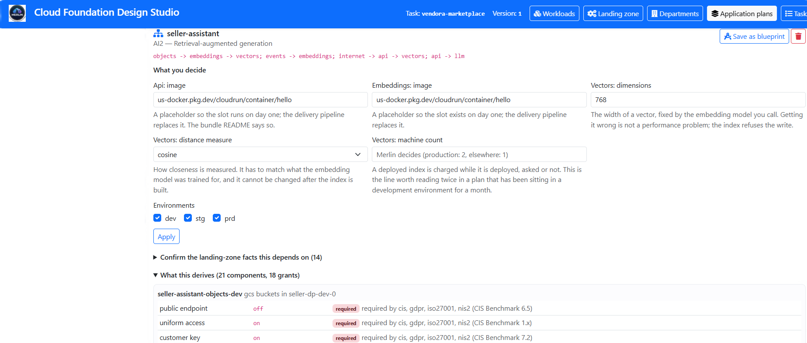

## 6. Review and generate

The last page says what the plan creates, per environment, and what generating
*now* would change compared with the last time. Then **Generate this plan**, and
**Download**. Each plan has its own bundle; generating one never changes another.

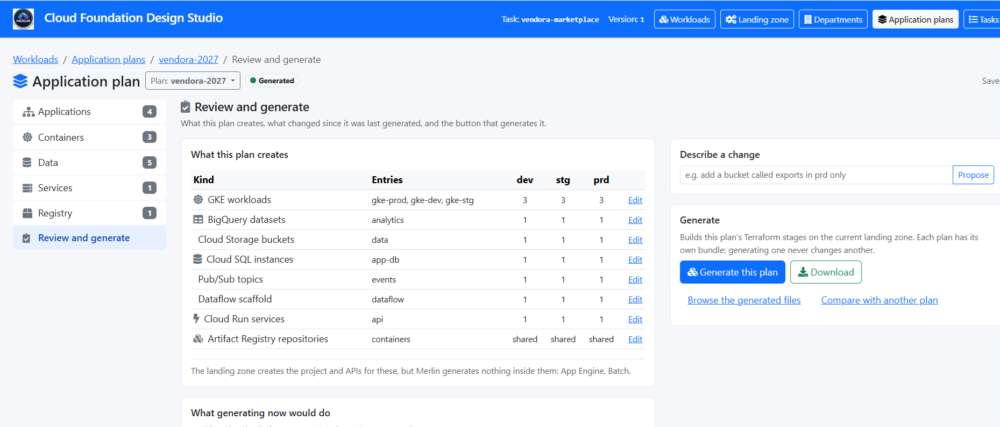

## What you get

One Terraform root per application per environment, a delivery stage for each
application, the platform stages beside them, and the documents that make the
result checkable rather than something to take on trust:

| | |
|---|---|
| [`3-app-<name>-<env>/`](applications) | the stage: `main.tf`, a readable `application.yaml` mirror of it, and a README with a **"Why each grant exists"** table |
| [`CONFORMANCE.md`](applications/CONFORMANCE.md) | every resource with its project, network, region and key, and **every setting with its source** — the foundation, a framework's control, a Merlin rule, or "your answer, on the Applications page" |
| [`VALIDATION_WARNINGS.md`](applications/VALIDATION_WARNINGS.md) | what Merlin decided differently from what was asked, and why |
| [`PLACEHOLDERS.md`](applications/PLACEHOLDERS.md) | every value that has to be yours before an apply |
| [`deploy/`](applications/deploy) | preflight, apply and verify scripts, and a runbook naming the identity that applies each stage |

Two things in this repository's bundle are worth reading as examples of the
approach:

- **An application is generated where the foundation can host it, and nowhere
  else.** `inventory-replica` reaches back into the datacentre, and only the
  production network has the VPN, so it was generated for production alone — and
  [`VALIDATION_WARNINGS.md`](applications/VALIDATION_WARNINGS.md) says so, naming
  the network and the fix.
- **The customer-managed key follows state, not the application.** In
  `seller-assistant` the corpus bucket, the vector index and the topic are
  encrypted with the foundation's keys; the Cloud Run services, which hold
  nothing, are not.

## Supported architectures

Twenty-five, in six families. "Needs" is what the foundation must already have
beyond the basics; an architecture whose need is not met cannot be hosted there.

### Serverless

| | Architecture | Flow | In short |
|---|---|---|---|
| A1 | Internet API, document store | `internet → api → documents` | A public API whose state is documents rather than rows. |
| A2 | Internet API, relational store | `internet → api → relational` | A public API with its own private relational database. |
| A3 | API with event analytics | `internet → api → relational` · `api → events → stream-processing → warehouse` | An API that publishes what happened to a stream a pipeline lands in a warehouse. The analytics never reach back into the database. *(`checkout` here.)* |
| A4 | Scheduled batch to warehouse | `schedule → job → relational` · `job → warehouse` | Work that runs on a clock, reads the operational database and writes somewhere it can be queried. Nothing is reachable from the internet. |
| A5 | File-driven batch pipeline | `objects → batch-processing → warehouse` | Files arrive in a bucket and a pipeline lands them in a warehouse. The input is the trigger. |

### AI

| | Architecture | Flow | In short |
|---|---|---|---|
| AI1 | Managed model behind an API | `internet → api → llm` · `api → documents` · `api → events → … → warehouse` | A service that answers using a foundation model: what gets screened, what gets logged, and where the question is processed. |
| AI2 | Retrieval-augmented generation | `objects → embeddings → vectors` · `internet → api → vectors` · `api → llm` | The model answers from your documents rather than from what it remembers. *(`seller-assistant` here.)* |
| AI3 | Agent with tools | `internet → agent-runtime → llm` · `agent-runtime → api` · `→ documents` · `→ events → … → warehouse` | An agent that calls a model to choose and your services to act, and writes down every step it took. |
| AI4 | Self-hosted open-weight model | `internet → api → served-model` · `objects → served-model` | A model you run yourself: the weights in your bucket, the accelerator yours by the hour. On Cloud Run or GKE. |
| AI5 | Batch inference and enrichment | `schedule → job → llm` · `job → warehouse` | A scheduled job that sends each row to a model and keeps what comes back. |
| AI6 | Document extraction pipeline | `objects → document-ai → llm` · `document-ai → warehouse` · `internet → api → warehouse` | A processor reads fields out of documents, a model tidies them, and a service lets someone check the uncertain ones. |
| AI7 | Tuning and evaluation | `objects → tuning → prediction` · `schedule → job → prediction` · `job → warehouse` | Teaching a model on your examples and finding out whether it got better. |
| AI8 | Classic prediction behind an API | `internet → api → prediction` · `api → documents` | A model you trained, served behind an endpoint: a score, a recommendation, a price. |

### Data and devices

| | Architecture | Flow | In short |
|---|---|---|---|
| D1 | Device telemetry ingestion | `devices → events → stream-processing → warehouse` · `→ timeseries` · `internet → api → timeseries` | A fleet in the field, each device authenticating as itself; readings land in a warehouse and a time-series store. |
| D2 | Streaming media delivery with analytics | `objects → cdn` · `internet → api → events → … → warehouse` | Files served from the edge, the bucket private, and a record of what was watched. |
| D3 | Data platform, landing to serving | `objects → batch-processing → warehouse` · `events → stream-processing → warehouse` · `schedule → job → warehouse` | The three ways data arrives, ending in one warehouse. A platform rather than an application: it is offered on the **Data** page. |

### Hybrid

| | Architecture | Flow | Needs | In short |
|---|---|---|---|---|
| H1 | Internal API reached from on-premises | `onprem → api → relational` · `api → documents` | VPN or Interconnect | An API with no public address at all; callers arrive over the foundation's private link. |
| H2 | Partner-facing API | `partner → api → relational` · `api → events` | — | Published to named partner projects over Private Service Connect. Nothing is peered, nothing is public. |
| H3 | Database replication to the cloud | `onprem → replicate → relational` · `schedule → job → relational` · `job → warehouse` | VPN or Interconnect | The database stays in the datacentre and a current copy lives in the cloud, kept up to date by change data capture. *(`inventory-replica` here.)* |
| H4 | File landing from on-premises | `onprem → transfer → objects → batch-processing → warehouse` | VPN or Interconnect | Files from the datacentre arrive in a bucket on a schedule. The bucket is the boundary. |

### Kubernetes

| | Architecture | Flow | Needs | In short |
|---|---|---|---|---|
| K1 | Microservices on the shared cluster | `internet → services → relational` · `services → events` · `services → cache` | a GKE cluster | Services behind one gateway, in a namespace of their own on the cluster the foundation built. *(`storefront` here.)* |
| K2 | Multi-region services on the shared fleet | `internet → services → global-relational` · `services → events → … → warehouse` | GKE clusters in several regions, as a fleet | The same services in several regions behind one gateway, over a database that is global rather than replicated. |
| K3 | Event-driven workers on the shared cluster | `events → worker → objects` · `worker → warehouse` | a GKE cluster | Workers that drain a queue. No gateway, no ingress, no port: internal by what it is. |

### Virtual machines

| | Architecture | Flow | Needs | In short |
|---|---|---|---|---|
| V1 | Three-tier VM web application | `internet → vm-tier → relational` · `vm-tier → cache` | — | The shape a lift-and-shift arrives in: identical machines behind a load balancer, a database, a cache. No instance has a public address. |
| V2 | Internal VM application from on-premises | `onprem → vm-tier → relational` | VPN or Interconnect | The lift-and-shift that never faced the public, reached from the datacentre. |

---

← [Back to the repository](README.md) · Generate your own at [app.merlin-studio.cloud](https://app.merlin-studio.cloud)
